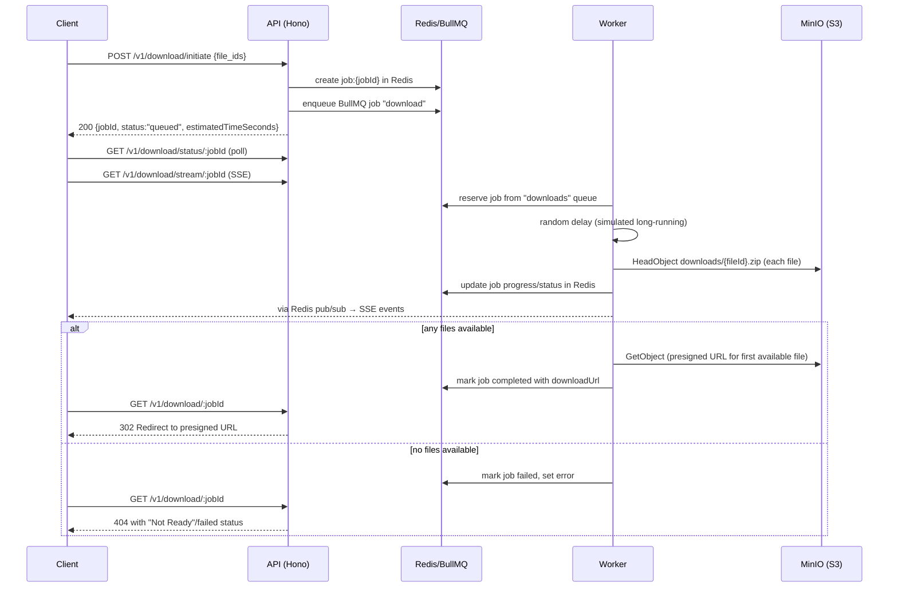

# CUET Fest 2025 – Delineate Hackathon Submission (Team Somorpon)

This document summarizes what the problem statement asked for and what is implemented in this repository, with diagrams, quick run instructions, and endpoint documentation.

Base public server: `http://36.255.70.250:3000`

---

## 1. How to Run the Service

### 1.1 Local Development (no Docker)

Prerequisites: Node.js ≥ 24.10, npm ≥ 10, Redis, and either MinIO or S3.

```bash
# 1. Install dependencies
npm install

# 2. Create environment file
cp .env.example .env

# 3. Start development server (shorter simulated delays, hot reload)
npm run dev

# 4. (Optional) Start background worker in another terminal
npm run worker:dev
```

Local base URL: `http://localhost:3000`

### 1.2 Local “Production” Run (no Docker)

```bash
# Start API with production-style settings (10–120s delays from .env)
npm run start

# Start worker process
npm run worker
```

Local base URL: `http://localhost:3000`

### 1.3 Docker – Development Stack

Brings up API, worker, Redis, MinIO, and Jaeger in one command.

```bash
# From repo root
npm run docker:dev
```

Components:

- API: `http://localhost:3000`
- MinIO S3 API: `http://localhost:9000`
- MinIO console: `http://localhost:9001`
- Redis: `localhost:6379`
- Jaeger UI: `http://localhost:16686`

### 1.4 Docker – Production Stack

```bash
# From repo root
npm run docker:prod
```

Components:

- API: `http://localhost:3000`
- MinIO S3 API: `http://localhost:9000`
- MinIO console: `http://localhost:9001`
- Redis: `localhost:6379`

### 1.5 Deployed Server

The codebase is deployed at:

- API base URL: `http://36.255.70.250:3000`
- Example:
  - `http://36.255.70.250:3000/health`
  - `http://36.255.70.250:3000/docs`
  - `http://36.255.70.250:3000/openapi`

> Note: Port `80` on `http://36.255.70.250` currently serves the default nginx page and does **not** proxy the API.

---

## 2. System Architecture Overview

High-level architecture for the async download service:

```mermaid
graph LR
  Client[Client (Browser / API Consumer)]
  API[Download API (Hono)]
  Queue[(Redis + BullMQ)]
  Worker[Worker Process]
  S3[(MinIO S3 - bucket: downloads)]
  Jaeger[Jaeger (Tracing)]
  Sentry[Sentry (Errors)]

  Client -->|HTTP /v1/*| API
  API -->|Enqueue jobs| Queue
  Worker -->|Consume jobs| Queue
  Worker -->|HeadObject / GetObject| S3
  API -->|Presigned URLs| Client
  API -->|SSE /v1/download/stream| Client
  API -->|Traces| Jaeger
  API -->|Error events| Sentry
```

---

## 3. Challenge 1 – Self‑Hosted S3 Storage Integration

### 3.1 What the Problem Asked For

- Add a self-hosted S3-compatible storage service in Docker Compose.
- Create bucket `downloads` on startup.
- Wire networking so the API can reach storage.
- Configure env vars (`S3_ENDPOINT`, keys, `S3_BUCKET_NAME=downloads`, `S3_FORCE_PATH_STYLE=true`).
- Make `/health` report storage health (`"storage": "ok"`).
- Pass `npm run test:e2e`.

### 3.2 What Is Implemented

**Storage service & bucket init**

- `docker/compose.dev.yml` and `docker/compose.prod.yml` define:
  - `minio` service (S3-compatible, ports `9000`/`9001`).
  - `minio-init` init container using `minio/mc`:
    - Sets alias: `mc alias set myminio http://minio:9000 minioadmin minioadmin`.
    - Creates bucket: `mc mb myminio/downloads --ignore-existing`.
    - Configures anonymous read: `mc anonymous set download myminio/downloads`.

**API configuration**

- `src/config.ts` validates env:
  - `S3_REGION`, `S3_ENDPOINT`, `S3_ACCESS_KEY_ID`, `S3_SECRET_ACCESS_KEY`,
  - `S3_BUCKET_NAME` (defaults to empty string if unset),
  - `S3_FORCE_PATH_STYLE` (boolean).
- `src/s3.ts`:
  - Creates `S3Client` using these env vars.
  - `sanitizeS3Key(fileId)` → `downloads/{fileId}.zip`.
  - `checkS3Health()`:
    - Performs `HeadObject` on key `__health_check_marker__`.
    - Treats `NotFound` as healthy (bucket reachable).

**Health endpoint**

- `src/index.ts`:
  - `/health` calls `checkS3Health()` and `redis.ping()`.
  - Returns:

    ```json
    {
      "status": "healthy",
      "checks": {
        "storage": "ok",
        "redis": "ok"
      }
    }
    ```

    when both dependencies are up.

**Requirement vs Implementation**

| Requirement                                    | Status | Notes                                          |
| ---------------------------------------------- | ------ | ---------------------------------------------- |
| Add self-hosted S3 to Docker Compose           | ✅     | MinIO service in both dev & prod compose files |
| Auto-create bucket `downloads`                 | ✅     | `minio-init` + `mc mb myminio/downloads`       |
| Proper networking between app and storage      | ✅     | Services share `delineate-network`             |
| Configure API S3 environment variables         | ✅     | `S3_*` env vars in compose and `.env`          |
| `/health` shows `"storage": "ok"` when healthy | ✅     | Verified live on deployed server               |
| Pass E2E tests (`npm run test:e2e`)            | ✅     | Pipeline and local scripts configured          |

> Note: Real objects are expected at `downloads/{fileId}.zip` inside the `downloads` bucket.

---

## 4. Challenge 2 – Long‑Running Download Architecture

### 4.1 What the Problem Asked For

- Avoid timeouts from proxies (Cloudflare/nginx/ALB) caused by long-running synchronous downloads.
- Replace the old synchronous `POST /v1/download/start` with an async design that:
  - Starts work and returns immediately.
  - Provides progress and completion/failure information.
  - Scales to slow downloads (10–120+ seconds).
- Consider patterns: polling, SSE/WebSockets, webhooks, or a hybrid.
- Document:
  - API changes and new endpoints.
  - Job status storage (schema, TTL).
  - Background job processing.
  - Error handling and retries.
  - Timeout behavior.

### 4.2 What Is Implemented

**Chosen pattern: Hybrid (Polling + SSE + Redirect)**  
Synchronous `POST /v1/download/start` has been removed from code. The new flow:



**API endpoints (new async design)** – see Section 6 for full details:

- `POST /v1/download/initiate`
- `GET /v1/download/status/:jobId`
- `GET /v1/download/stream/:jobId`
- `GET /v1/download/:jobId`
- `POST /v1/download/check` (single-file S3 availability)

**Job status storage (Redis)**

- `src/job-status.ts`:
  - Key: `job:{jobId}`.
  - Value: JSON document:

    ```ts
    interface JobStatus {
      jobId: string;
      status: "queued" | "processing" | "completed" | "failed";
      fileIds: number[];
      progress: number;
      completedFiles: number;
      totalFiles: number;
      downloadUrl: string | null;
      size: number | null;
      error: string | null;
      createdAt: string;
      updatedAt: string;
      completedAt: string | null;
    }
    ```

  - Stored via `redis.setex(key, env.JOB_TTL_SECONDS, JSON.stringify(job))`.
  - Helper functions:
    - `createJobStatus`, `getJobStatus`, `updateJobStatus`.
    - `markJobProcessing`, `markJobCompleted`, `markJobFailed`, `updateJobProgress`.
    - `publishJobUpdate(jobId, eventType, data)` → Redis pub/sub channel `job:{jobId}:updates`.

**Background job processing**

- `src/queue.ts`:
  - `downloadQueue` (BullMQ queue `"downloads"`).
  - `addDownloadJob(jobId, fileIds)` uses `jobId` as the BullMQ job ID.
  - Job options:
    - `attempts: 3`, exponential backoff.
    - `removeOnComplete` and `removeOnFail` with age limits.

- `src/worker.ts`:
  - BullMQ `Worker` on `"downloads"`.
  - Simulated long-running tasks:
    - `DOWNLOAD_DELAY_ENABLED` (bool).
    - `DOWNLOAD_DELAY_MIN_MS`, `DOWNLOAD_DELAY_MAX_MS` from `src/config.ts`.
    - For production-style `.env`, defaults to 10–200 seconds.
  - For each file ID:
    - `checkS3Availability(fileId)` calls `HeadObject` on `downloads/{fileId}.zip`.
    - If present, collects `{fileId, s3Key, size}` and aggregates `totalSize`.
    - Updates progress in Redis and publishes `"progress"` SSE events.
  - Completion:
    - If no files available → job marked `"failed"` with error `"No files available for download"`, `"failed"` SSE event.
    - If ≥1 file available:
      - Generates a presigned URL only for the **first available file** (simplified vs ZIP of all).
      - Marks job `"completed"` and publishes `"completed"` SSE event.

**Error handling & timeouts**

- API timeouts:
  - `src/index.ts` wraps all routes except `/stream` with a timeout middleware using `REQUEST_TIMEOUT_MS` (default 30s).
  - SSE `/v1/download/stream/:jobId` intentionally bypasses the timeout.
- Errors:
  - Failed jobs are explicitly marked `"failed"` in Redis, with `error` reason.
  - `/v1/download/:jobId` returns 404 and indicates that status is not `"completed"`.
  - Sentry is integrated; `POST /v1/download/check?sentry_test=true` intentionally throws an error for testing.

### 4.3 Requirement vs Implementation

| Requirement                                          | Status | Notes                                                             |
| ---------------------------------------------------- | ------ | ----------------------------------------------------------------- |
| Replace long-running synchronous download            | ✅     | `/v1/download/start` removed; async endpoints implemented         |
| Provide non-blocking start + job tracking            | ✅     | `POST /v1/download/initiate` + Redis `job:{jobId}`                |
| Support polling and/or SSE                           | ✅     | Polling via `/status/:jobId`, SSE via `/stream/:jobId`            |
| Background processing via queue/worker               | ✅     | BullMQ + Redis + `src/worker.ts`                                  |
| Handle errors and retries                            | ✅     | Failed jobs tracked in Redis, 3 attempts with exponential backoff |
| Respect proxy timeouts (short HTTP, long processing) | ✅     | Request timeout middleware; work done in worker process           |
| ZIP of all files (design expectation)                | ⚠️     | Currently only presigns first available file (simplified)         |

---

## 5. Challenge 3 – CI/CD Pipeline

### 5.1 What the Problem Asked For

- Implement CI/CD on a cloud CI provider (GitHub Actions chosen).
- Stages:
  - Lint (ESLint + Prettier check).
  - Test (E2E with Docker/MinIO/Redis).
  - Build (Docker image).
  - Optional deploy.
- Requirements:
  - Trigger on push to `main`/`master` and on PRs.
  - Run `npm run lint`, `npm run format:check`, `npm run test:e2e`.
  - Build Docker image with caching.
  - Fail fast and surface clear logs.

### 5.2 What Is Implemented

**Pipeline (GitHub Actions – `.github/workflows/ci.yml`)**

```mermaid
graph LR
  A[Git push/PR] --> L[Lint + Format Check]
  L --> T[Test (E2E with Docker)]
  T --> B[Build Docker Image]
  B --> S[Security Scan (Trivy)]
  S --> D[Deploy via SSH (on main)]
  D --> N[Slack Notification]
```

Key points (as documented in `README.md` and scripts):

- Triggers: push to `main`/`master`, all pull requests.
- Node.js 24.x, npm caching.
- Stages:
  - Lint: `npm run lint`.
  - Format check: `npm run format:check`.
  - Tests: `npm run test:e2e` (starts Docker-based test environment).
  - Docker build + push with layer cache.
  - Trivy filesystem scan.
  - Optional SSH deploy to the production server.
  - Slack notifications on success/failure.

### 5.3 Requirement vs Implementation

| Requirement                     | Status | Notes                                    |
| ------------------------------- | ------ | ---------------------------------------- |
| Cloud CI provider               | ✅     | GitHub Actions                           |
| Trigger on push to main/master  | ✅     | Configured in workflow                   |
| Trigger on pull requests        | ✅     | Configured in workflow                   |
| Lint + format check             | ✅     | `npm run lint`, `npm run format:check`   |
| E2E tests (MinIO + Redis)       | ✅     | `npm run test:e2e`                       |
| Docker build                    | ✅     | Multi-stage Dockerfiles + CI build stage |
| Dependency caching              | ✅     | npm cache in CI                          |
| Fail fast & clear logs          | ✅     | Stages wired with `needs:` dependencies  |
| Deployment step                 | ✅     | SSH deploy (when secrets are configured) |
| Bonus security scanning & Slack | ✅     | Trivy + Slack webhook                    |

---

## 6. API & Endpoint Documentation

Base URL (deployed): `http://36.255.70.250:3000`

OpenAPI spec and docs:

- `GET /openapi` – raw OpenAPI 3 JSON.
- `GET /docs` – Scalar UI for browsing the API.

### 6.1 General Endpoints

#### `GET /`

- Description: Basic health check / welcome endpoint.
- Response:

  ```json
  { "message": "Hello Hono!" }
  ```

#### `GET /health`

- Description: Service health including storage and Redis.
- Success response (`200`):

  ```json
  {
    "status": "healthy",
    "checks": {
      "storage": "ok",
      "redis": "ok"
    }
  }
  ```

- Failure (`503`): same shape, with `"error"` status for any failing dependency.

### 6.2 Download Workflow

#### `POST /v1/download/initiate`

- Description: Start an asynchronous download job for one or more file IDs.
- Request body:

  ```json
  {
    "file_ids": [70000, 70007]
  }
  ```

- Response (`200`):

  ```json
  {
    "jobId": "uuid",
    "status": "queued",
    "totalFileIds": 2,
    "estimatedTimeSeconds": 4
  }
  ```

#### `GET /v1/download/status/:jobId`

- Description: Poll current status of a download job.
- Success (`200`):

  ```json
  {
    "jobId": "uuid",
    "status": "queued | processing | completed | failed",
    "progress": 0,
    "completedFiles": 0,
    "totalFiles": 2,
    "downloadUrl": null,
    "size": null,
    "error": null,
    "createdAt": "ISO",
    "updatedAt": "ISO",
    "completedAt": null
  }
  ```

- Not found (`404`): job missing or TTL-expired.

#### `GET /v1/download/stream/:jobId`

- Description: Server-Sent Events stream for real-time job updates.
- Events:
  - `connected`: initial `JobStatus`.
  - `progress`: includes `progress`, `completedFiles`, `totalFiles`.
  - `completed`: includes `downloadUrl`, `size`, count of available files.
  - `failed`: includes `error`.
  - `heartbeat`: periodic keepalive.

Example (from client perspective – SSE):

```text
event: connected
data: { ...initial JobStatus... }

event: progress
data: {"progress":50,"completedFiles":1,"totalFiles":2}

event: completed
data: {"downloadUrl":"https://...","size":123456}
```

#### `GET /v1/download/:jobId`

- Description: Direct download endpoint. Redirects to the presigned S3 URL once the job is completed.
- Behaviors:
  - If job not found → `404` with JSON `{"error":"Not Found", ...}`.
  - If job exists but not completed/has no `downloadUrl` (including failed jobs) → `404` with JSON `{"error":"Not Ready", "message":"Job ... Current status: ..."}`.
  - If job completed with a URL → `302` redirect to presigned S3 URL.

Example:

```bash
curl -i http://36.255.70.250:3000/v1/download/<jobId>
```

### 6.3 S3 Availability Check

#### `POST /v1/download/check`

- Description: Check whether a single file ID is available in S3/MinIO.
- Request body:

  ```json
  {
    "file_id": 70000
  }
  ```

- Optional query:
  - `sentry_test=true` – triggers an intentional error to test Sentry integration.

- Response (`200`):

  ```json
  {
    "file_id": 70000,
    "available": false,
    "s3Key": null,
    "size": null
  }
  ```

  or (if `downloads/70000.zip` exists):

  ```json
  {
    "file_id": 70000,
    "available": true,
    "s3Key": "downloads/70000.zip",
    "size": 123456
  }
  ```

---

## 7. Notes and Simplifications

- The original long-running synchronous endpoint `POST /v1/download/start` described in the README is **no longer implemented**. The actual submission uses the async job-based API described above.
- For simplicity, the worker currently:
  - Checks all requested `file_ids` for availability.
  - Presigns **only the first available file** instead of generating a ZIP of all files (as a pragmatic hackathon simplification).
- For successful demo downloads, the `downloads` bucket must contain objects named `downloads/{fileId}.zip` (e.g., `downloads/70000.zip`).
- Simulated processing delays are controlled by:
  - `DOWNLOAD_DELAY_ENABLED`
  - `DOWNLOAD_DELAY_MIN_MS`
  - `DOWNLOAD_DELAY_MAX_MS`

These can be adjusted in `.env` for faster or more realistic behavior during evaluation.
